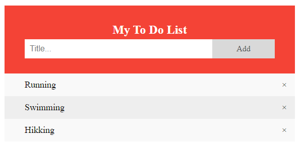

# To Do List

## Group Project #3

In the group project assignation for this HYF module [separation-of-concerns](https://github.com/HackYourFutureBelgium/separation-of-concerns) week 3, we are going todevelop a "To do list" from scratch using the knowledges adquired during this course. 

Based in  our user stories, we will create our strategy and then, doing reversed-engineering of different sites and applications from our choise, we are going to develop our own site. 

Here we can see some options we are considering:

